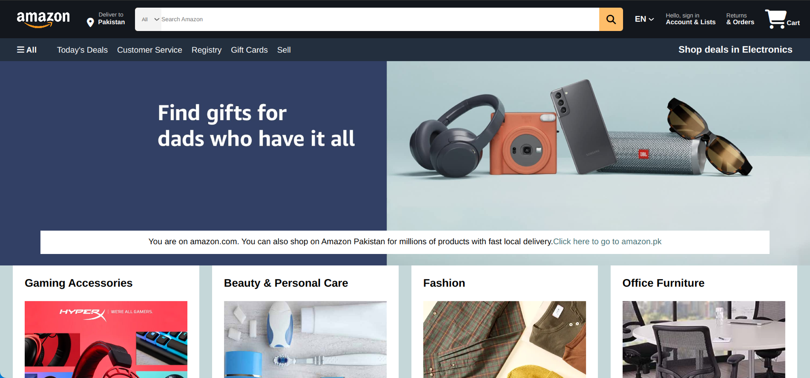
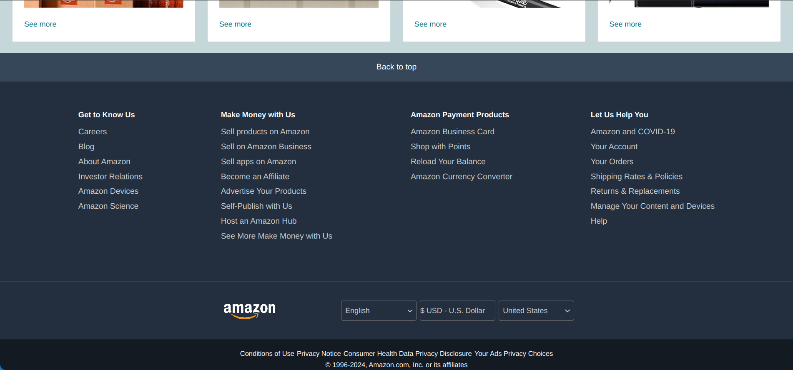

# Amazon Clone

This clone is a replica of the Amazon homepage, created using HTML and CSS. This project demonstrates my front-end development skills and  core knowledge of css flexbox.
 
## Table of Contents
- [Screenshots](#screenshots)
- [Live Preview](#live-preview)
- [Technologies Used](#technologies-used)
- [Contributing](#contributing)
- [License](#license)
## Screenshots

## Live Preview
1. Click [here](https://amazon-clone-mian-saad-tahir.netlify.app/) to view live demo.

## Technologies Used
- HTML
- CSS

## Contributing
Contributions, issues, and feature requests are welcome!  
Feel free to check out the [issues page](https://github.com/miansaadtahir/Amazon-Clone/issues) for more information.
## License

This project is open source and available under the MIT [License](https://github.com/MianSaadTahir/Amazon-Clone/blob/main/LICENSE).
